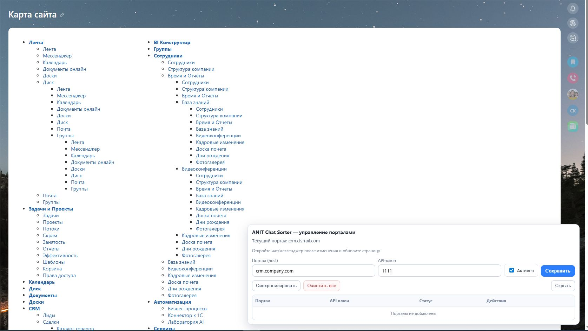
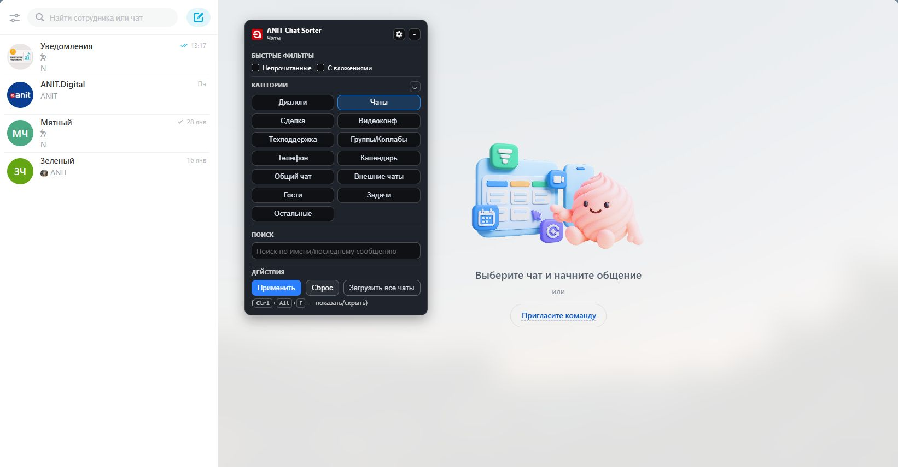
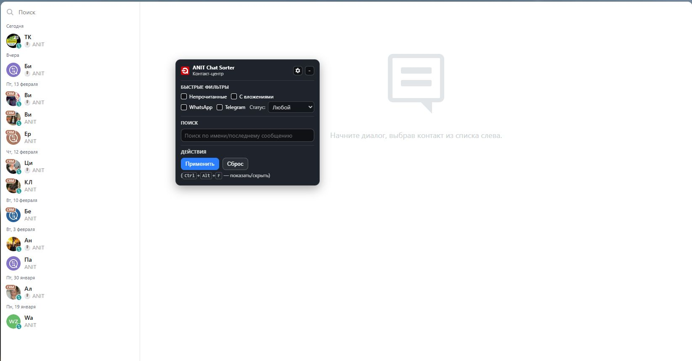
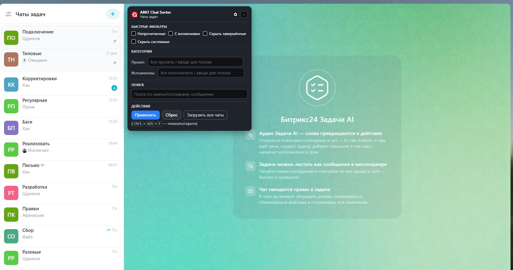
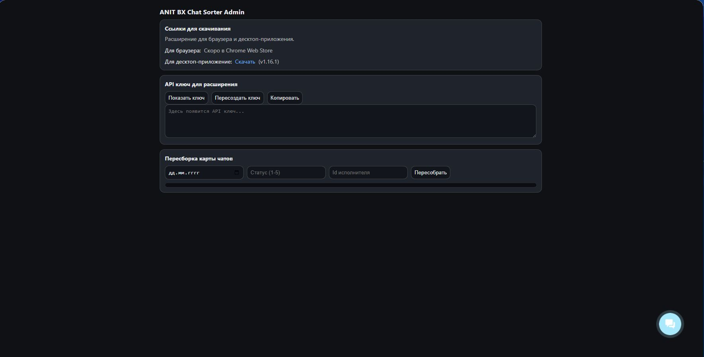

# ANIT Chat Sorter

Расширение для Битрикс24, которое добавляет **панель фильтров** для списка чатов: скрытие «лишних» и  группировка по датам в Открытых линиях.

---

## 📑 Оглавление

- [Возможности](#-возможности)
- [Установка](#-установка)
  - [Вариант 1 — Desktop (Windows)](#вариант-1--desktop-клиент-битрикс24-на-windows)
  - [Вариант 2 — Браузер](#вариант-2--браузер-chromium-based-chrome-яндексбраузер-и-др)
  - [Вариант 3 — Desktop macOS](#вариант-3--desktop-macos-клиент-битрикс24-на-macos)
- [Интеграция с порталом Битрикс24](#-интеграция-с-порталом-битрикс24)
  - [Порталы с собственным доменом](#порталы-с-собственным-доменом)
  - [Desktop: добавления своего домена](#desktop-добавление-своего-домена)
- [Как пользоваться](#-как-пользоваться)
- [Приватность](#-приватность)
- [Поддержка](#-поддержка)
- [Скриншоты](#-скриншоты)

---

## ✨ Возможности

- **Панель фильтров**:
    - Непрочитанные / с вложениями
    - Поиск по названию и последнему сообщению
    - Для **Открытых линий**: WhatsApp / Telegram, статусы
    - Для **внутренних чатов**: выбор типов (Диалоги, Чаты, Группы/Коллабы, Телефон, Календарь, Общий, Новости и др.)
- **Группировка по датам** в Открытых линиях
- **Горячая клавиша**: `Ctrl + Alt + F` — показать/скрыть
- **Перетаскивание по всему окну**, позиция сохраняется
- Появляется **только** на страницах списка чатов
- По **зажатию ПКМ** появляется возможность множественного выбора чатов для совершения действий (Посмотреть позже/Закрепить/Выключить звук/Скрыть и т.д)
---

## 📦 Установка

### Вариант 1 — Desktop (клиент Битрикс24 на Windows)

1. В разделе **Release** нажмите на **Последний релиз (например v1.15.0)** → **Нажмите на bx24_sortOL.zip** и распакуйте архив.
2. Создайте папку (например, `C:\ext`) и **перенесите** туда файлы расширения.
3. Кликните **ПКМ по ярлыку** «Битрикс24» → **Свойства** → вкладка **Ярлык** → поле **Объект**.
4. **Добавьте в конец** строки параметры запуска, указав ваш путь к папке:
   `--disable-extensions-except="C:\ext" --load-extension="C:\ext"`
5. В итоге «Объект» должен выглядеть примерно так: `"C:\Program Files (x86)\Bitrix24\Bitrix24.exe" --disable-extensions-except="C:\ext" --load-extension="C:\ext"`
6. Сохраните изменения и запустите клиент Битрикс24.

---

### Вариант 2 — Браузер (Chromium-based: Chrome, Яндекс.Браузер и др.)

1. В разделе **Release** нажмите на **Последний релиз (например v1.15.0)** → **Нажмите на bx24_sortOL.zip** и распакуйте архив.
2. Откройте страницу расширений:
- Chrome: `chrome://extensions/`
- Яндекс.Браузер: `browser://extensions/`
3. Включите **Режим разработчика**.
4. Нажмите **Загрузить распакованное расширение**.
5. Укажите путь к папке с файлами расширения.
---
### Вариант 3 — Desktop macOS (клиент Битрикс24 на macOS)

#### 1. Скачивание расширения
1. Перейдите в раздел **Release**.
2. Откройте **последний релиз** (например, `v1.15.0`).
3. Скачайте архив **`bx24_sortOL.zip`** и распакуйте его.
4. Создайте папку (например, `ext`) и переместите в неё файлы расширения.

#### 2. Создание ярлыка через Automator
1. Откройте **Automator**  
   `⌘ + Space → Automator`
2. Выберите **Новое приложение (Application)**.
3. Добавьте действие:  
   **Утилиты → Запустить shell-скрипт**

#### 3. Получение пути к Bitrix24
1. Откройте **Finder**.
2. Перейдите в папку **Программы**.
3. Найдите **Bitrix24.app**.
4. Зажмите **⌥ Option** → кликните правой кнопкой мыши по Bitrix24.
5. Выберите **«Скопировать “Bitrix24” как путь»**.
6. К полученному пути добавьте: /Contents/MacOS/Bitrix24 

#### 4. Настройка команды запуска
В окне Automator укажите:
- **Shell:** `/bin/zsh`
Вставьте команду:
```bash
"/Applications/Bitrix24.app/Contents/MacOS/Bitrix24" \
--disable-extensions-except="/Users/anit/ext" \
--load-extension="/Users/anit/ext"
```

где:
- `/Applications/Bitrix24.app/Contents/MacOS/Bitrix24` — путь к клиенту Битрикс24;
- `/Users/anit/ext` — путь к папке с расширением.

#### 5. Сохранение приложения
Сохраните приложение, например под именем **Bitrix24 Dev.app**  
(можно сохранить в папку «Программы» или на Рабочий стол).

#### 6. Назначение иконки (опционально)
1. Найдите оригинальный **Bitrix24.app**.
2. Кликните по нему один раз и нажмите **⌘ + I**.
3. В окне информации кликните по иконке в левом верхнем углу  
   (должна появиться синяя рамка) и нажмите **⌘ + C**.
4. Откройте свойства своего приложения **Bitrix24 Dev.app** (`⌘ + I`).
5. Кликните по иконке и нажмите **⌘ + V**.

---

## 🔗 Интеграция с порталом Битрикс24
> (скоро будет доступно)

Чтобы использовать фильтры по проектам и исполнителям в чатах задач:

1. Установите приложение (приложение ещё находится на модерации): [https://www.bitrix24.ru/apps/app/anit.chat_sorter/](https://www.bitrix24.ru/apps/app/anit.chat_sorter/)
2. Скопируйте **Ключ** в приложении.
3. В окне расширения нажмите на **шестерёнку** и вставьте ключ.
4. Перезагрузите страницу.

### Порталы с собственным доменом

Если портал работает не на `*.bitrix24.ru` (например, `crm.company.ru`), его тоже можно подключить:

1. Откройте настройки расширения (иконка расширения → Настройки расширения).
2. В поле **Портал** укажите домен:
   - правильно: `crm.company.ru`
   - неправильно: `https://crm.company.ru/` или `crm.company.ru/path`
3. Вставьте API-ключ (если его нет - любое значение) и нажмите **Сохранить**.
4. Подтвердите системный запрос браузера на доступ расширения к домену.
5. Обновите вкладку портала.

### Desktop: добавление своего домена

Для Desktop-клиента используйте встроенную страницу подключения:

1. Перейдите на страницу: `https://<ваш-домен>/add/ext_bx24sortOL` (пример: можно отправить эту ссылку себе в чат и перейти по ней).
2. В правом нижнем углу появится окно управления расширением.
3. Добавьте свой портал (или сохраните текущий) и нажмите **Сохранить**.
4. Разрешите расширению доступ к вашему домену (если система запросит разрешение).
5. Перейдите в мессенджер и обновите страницу — после этого можно пользоваться расширением.




---

## 🧭 Как пользоваться

- Панель появится вверху списка чатов.
- Выставьте нужные флажки — список обновится мгновенно.
- Перетащите панель в удобное место — позиция **запоминается**.
- Скрыть/показать:
- кнопкой в заголовке, **или**
- горячей клавишей **`Ctrl + Alt + F`**. (**для MacOS`⌘ + ⌥ Option + F `**)

---

## 🔒 Приватность

Расширение работает **локально** в клиенте/браузере. Никакие данные чатов **не отправляются** наружу — фильтрация выполняется по DOM интерфейса Битрикс24.

---


## 🧩 Поддержка

Наш сайт: **[anit-b24.ru](https://anit-b24.ru)**  
Вопросы, идеи и багрепорты — всегда приветствуются! https://anit.bitrix24.ru/online/techhelp

---

## 📸 Скриншоты

**Чаты** 



**Чаты**


**Открытые линии** 



**Чаты задач** 



**Приложение в Битрикс24** 



---

> © ANIT «ANIT Chat Sorter» — вспомогательное расширение для упрощения работы со списком чатов Битрикс24. Используйте на свой страх и риск. Все упомянутые названия и логотипы принадлежат их правообладателям.
